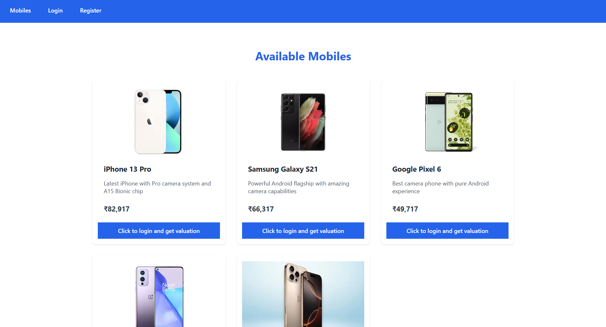
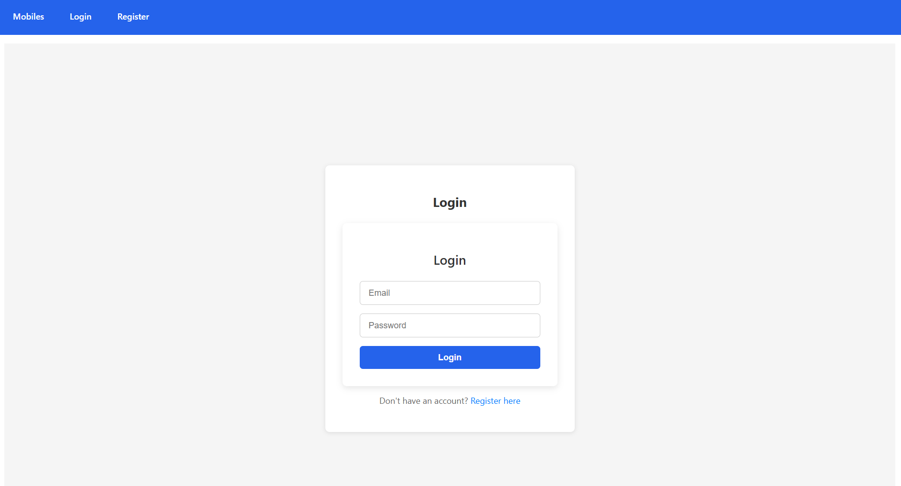
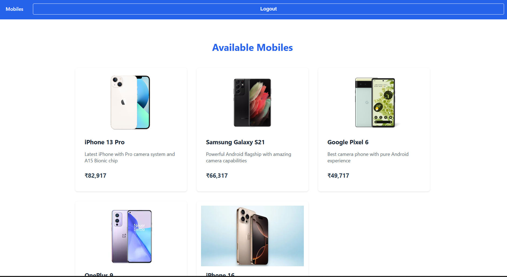
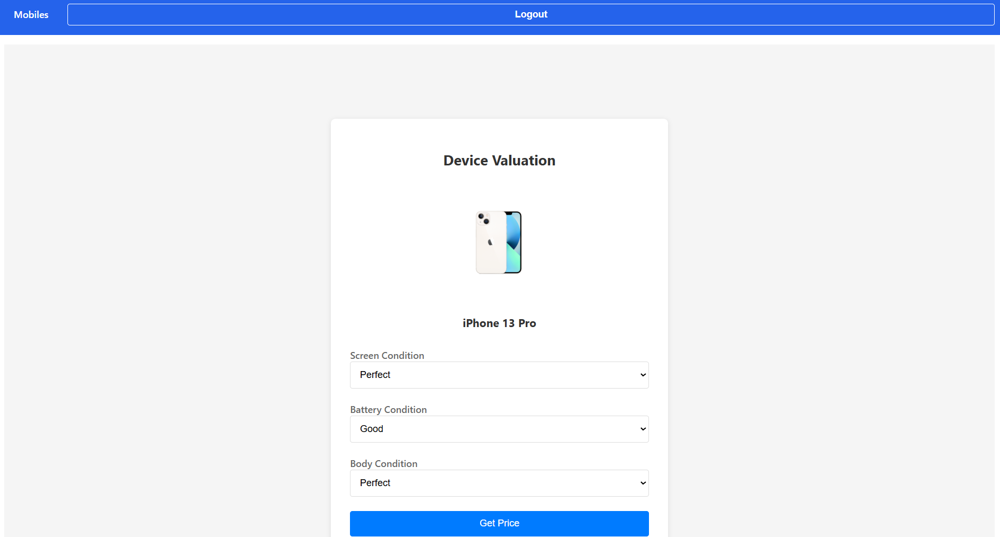

#  ReCommerce - Mobile Device Marketplace

I have built a simple recommerce website that evaluates devices. Initially, users can only see the list of mobile devices, and once they log in, they can get the exact value of a device based on the conditions they select.

**Live Demo (Frontend):** [https://statuesque-hamster-e20480.netlify.app](https://statuesque-hamster-e20480.netlify.app)  
**Backend API:** [https://recommerce-backend-1.onrender.com](https://recommerce-backend-1.onrender.com)







---

##  Features

### User Features
- Secure user authentication with JWT  
- Register, Login & Profile management  
- Browse, search, and filter available devices  
- Responsive UI for desktop & mobile  

### Device Management
- Add, update, and delete device listings  
- View detailed device information  

---

##  Tech Stack

### Frontend
- React.js (v19.1.0)  
- React Router DOM (v7.6.0)  
- Modern JavaScript (ES6+)  
- Responsive CSS  
- Environment-based config with `.env`  

### Backend
- Spring Boot (v3.5.0)  
- Spring Security & JWT Authentication  
- MongoDB (Atlas)  
- Java 17, Maven  

---

##  Getting Started

### Prerequisites
- Node.js (v14+)  
- Java 17+  
- MongoDB Atlas account  
- Maven  

---

### Setup Instructions

1. **Clone the repository**

```bash
git clone [your-repo-url]
cd HelloFi_Internship_Task
Frontend setup
cd client
npm install
Create .env file inside client/ with:
REACT_APP_API_BASE_URL=http://localhost:8080
Start React dev server:
npm start
Backend Setup
cd ../server/hellofi-backend
Create or update application.properties with:
spring.data.mongodb.uri=your_mongodb_uri
jwt.secret=your_jwt_secret
server.port=8080
Build and run backend:
mvn clean install
mvn spring-boot:run
Deployment

Frontend (Netlify)
URL: https://statuesque-hamster-e20480.netlify.app

Environment Variables:

REACT_APP_API_BASE_URL=https://recommerce-backend-1.onrender.com

Backend (Render)
URL: https://recommerce-backend-1.onrender.com

Environment Variables:

MONGODB_URI

JWT_SECRET

Security
JWT-based authentication & authorization

Password encryption with BCrypt

CORS configured for frontend-backend communication

Protected API routes with Spring Security

Project Structure
Frontend (client/)
client/
├── src/
│   ├── components/      # Reusable UI components
│   ├── pages/           # Page-level components
│   ├── services/        # API calls & auth services
│   ├── styles/          # CSS files
│   └── App.js           # Main React app component
├── public/              # Static assets
├── package.json
└── .env
Backend (server/hellofi-backend/)
server/hellofi-backend/
├── src/
│   ├── main/
│   │   ├── java/
│   │   │   ├── controllers/   # REST API controllers
│   │   │   ├── models/        # Data models/entities
│   │   │   ├── repositories/  # MongoDB repositories
│   │   │   ├── security/      # Security config and filters
│   │   │   ├── services/      # Business logic services
│   │   └── resources/
│   │       └── application.properties
├── pom.xml
└── Dockerfile
API Endpoints
Authentication
POST /api/auth/register — Register a new user

POST /api/auth/login — User login, returns JWT

GET /api/auth/check — Verify auth status

Devices
GET /api/devices — Get all device listings

POST /api/devices — Add new device listing

GET /api/devices/{id} — Get device details

PUT /api/devices/{id} — Update device listing

DELETE /api/devices/{id} — Remove device listing

